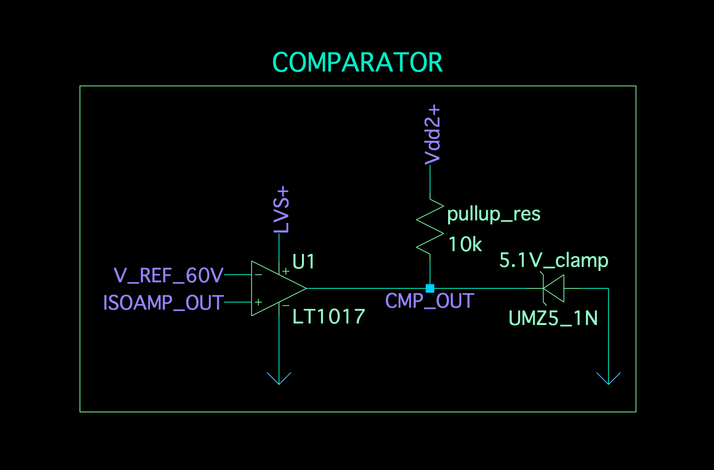

# Comparator (TS Voltage vs Threshold)

The **LT1017 comparator** is used to decide whether the (scaled) TS voltage is above the (scaled) threshold.

## Circuit Diagram / Schematic

## Connections

- **Non-inverting input (+):** output from the isolation amplifier (scaled TS voltage)
- **Inverting input (−):** output from the TL431 reference network (scaled 60 V threshold)

## Logic

The comparator output goes high when:

$$
V_{TS,scaled} > V_{ref}
$$

## Output conditioning (for logic gating)

- The LT1017 output stage is commonly used as an **open-collector output**, so a **pull-up resistor** (e.g., 10 kΩ) is required to obtain a defined logic-high level.
- If the pull-up is to a voltage higher than 5 V, a **zener clamp** can be used to limit the logic level to ~5 V for the AND gate input.
